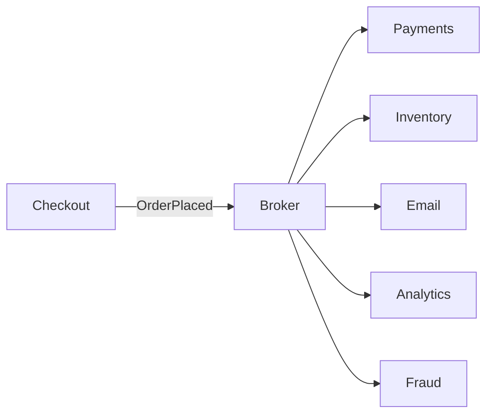
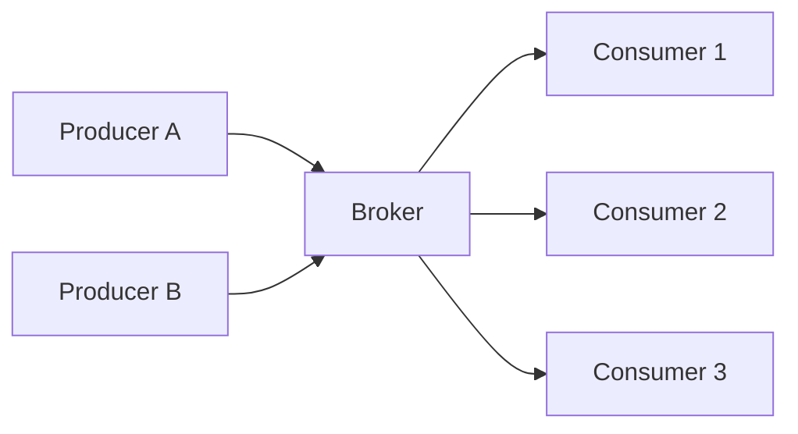
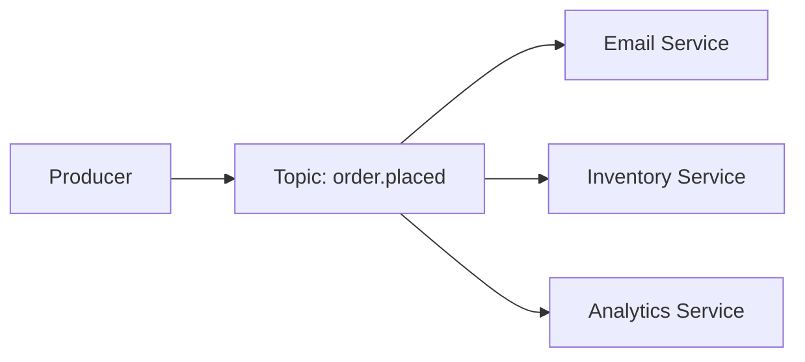
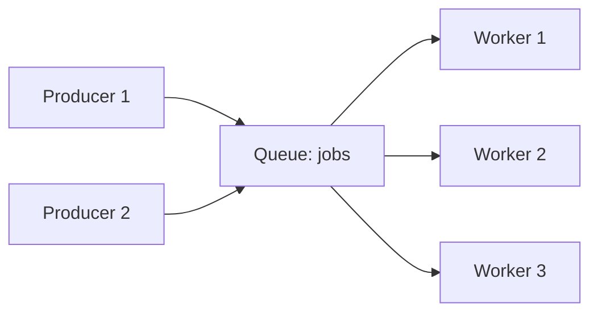
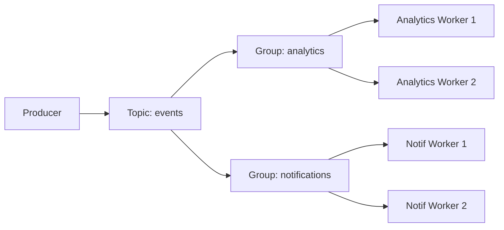
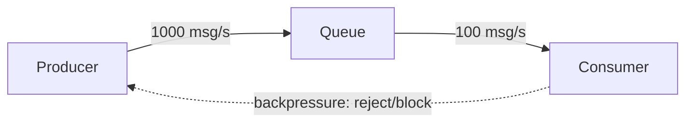

# Pub/Sub and Messaging

Two services need to communicate. The default move is a direct call: A invokes B over HTTP and waits for the response. This works for simple systems and is the right tool when the caller genuinely needs B's answer before continuing. But once the answer isn't needed immediately -- once "tell B that this happened" is enough -- the direct-call pattern starts to cost more than it pays for, and a different shape of communication becomes the right tool.

That different shape is **messaging**: a producer publishes a message to a broker, the broker holds it, one or more consumers read it on their own schedule. This page is about why messaging exists, what the broker is, and the standard topologies, delivery guarantees, and trade-offs you'll meet in any concrete tool.

> **Prerequisite:** This page is the architecture-level cousin of [Synchronous vs Asynchronous I/O](03-sync-vs-async-communication.md), which covers the same blocking-vs-not-blocking idea inside a single process. The vocabulary overlaps; the failure modes don't. Read that page first if "async" is a new concept to you.

---

## The Problem: Coupling Between Services

Consider a checkout flow. A user clicks "Place Order." The checkout service does four things:

1. Charge the card.
2. Reserve inventory.
3. Send a confirmation email.
4. Update analytics.

The natural way to write this is as four direct calls:

```python
def place_order(order):
    payments.charge(order)
    inventory.reserve(order)
    email.send_confirmation(order)
    analytics.record(order)
    return "ok"
```

This works. It also creates three kinds of coupling that get worse with every service added.

### Coupling #1: Lifetime

Every downstream service must be **up at the same time** as `place_order`. If `email` is down, the call raises. The user sees an error. The order was never completed -- even though three out of four steps would have succeeded.

System availability becomes the *product* of individual availabilities. Four services at 99.9% each is 99.6% combined; ten of them is 99.0%. The naive fix -- wrap each call in `try/except` -- silently trades a visible failure for an inconsistent system: the order was placed, but no email went out, and nothing knows the email is missing.

### Coupling #2: Latency

The user waits for the sum of all four calls. If `analytics.record` slows down today because the analytics database is under load, the user waits for it -- even though analytics has no business being on the user's critical path.

```
charge_card:        80ms
reserve_inventory:  40ms
send_confirmation: 200ms   ← slow today
record_analytics:  300ms   ← also slow today
                  -------
                   620ms total
```

Worse: while `place_order` is blocked on `analytics`, the calling thread is tied up. The checkout service's throughput collapses for reasons that have nothing to do with serving users. This is the textbook condition for a **cascade failure** -- one slow downstream service drags down everything upstream of it.

### Coupling #3: Knowledge

The checkout service has to know about every consumer of "an order was placed." When a fraud team adds a new check, somebody has to modify `place_order`. Every new consumer forces a change to the producer:

```python
def place_order(order):
    payments.charge(order)
    inventory.reserve(order)
    email.send_confirmation(order)
    analytics.record(order)
    fraud.check(order)             # ← new code in checkout
    loyalty.award_points(order)    # ← and again
    warehouse.notify(order)        # ← and again
```

The checkout team becomes a bottleneck for changes that have nothing to do with checkout.

---

## The Fix: A Broker In The Middle

Now imagine the same flow with a **broker** between checkout and the consumers. Checkout publishes one message: `OrderPlaced{order_id, ...}`. It does not know who reads it.



Each form of coupling is broken:

- **Lifetime:** Email can be down. The message sits in the broker. When email comes back, it processes the backlog. Checkout never knew.
- **Latency:** Checkout returns as soon as the broker accepts the message -- usually a few milliseconds. The user does not wait for analytics.
- **Knowledge:** A new fraud team subscribes to `OrderPlaced` without anyone modifying checkout. Checkout's code is closed for modification, open for extension.

This is async I/O between services -- the broker plays the role the event loop plays in async code: a place where work goes to live until someone is ready to handle it. The mechanism is different (a separate process, often on a separate machine, with persistence and replication) but the property is the same: **the caller hands off and continues; the work happens later**.

---

## Core Components



- **Producer (publisher):** sends messages without caring who reads them.
- **Broker:** the intermediary that receives, routes, and (optionally) stores messages.
- **Consumer (subscriber):** receives messages from topics it has subscribed to.
- **Topic / channel:** the named "pipe" through which messages flow.

The broker is the design centre. Whether it persists messages, how long it retains them, whether it supports replay, how it handles slow consumers -- these choices define the entire system's behaviour. Different broker implementations make different choices, which is why "RabbitMQ" and "Kafka" feel like different shapes of tool even though both are "message brokers."

---

## Messaging Topologies

### Fan-Out (One-to-Many)

A single message is delivered to all subscribers. Every consumer receives every message.



**Use cases:** event propagation across services -- an `OrderPlaced` event triggering email, inventory, and analytics simultaneously.

**Trade-off:** every consumer sees every message. There's no way to divide load across consumers of the same subscription -- if you want that, you need consumer groups (below).

### Point-to-Point (Queue)

Each message is delivered to exactly one consumer. A pool of consumers competes for messages. This is a **work queue** or **task queue** pattern.



**Use cases:** background job processing, image resizing, email sending -- any task that should be handled once and can be distributed across workers.

**Trade-off:** only one consumer gets each message. Not suitable for broadcasting an event to multiple independent systems.

### Consumer Groups (Both at Once)

The compromise: multiple consumer groups each receive all messages (fan-out *between* groups), but within each group, messages are divided across members (queue behaviour *within* a group).



This is the model Kafka and Redis Streams popularised. Each downstream system is its own group, sees all events, and scales horizontally inside its group. It generalises both of the previous topologies: "one group with one consumer" is a queue; "many groups with one consumer each" is fan-out.

---

## Delivery Guarantees

What the broker promises about whether a message reaches a consumer is one of the most consequential design choices in the whole system. There are three classic levels.

### At-Most-Once

Messages are delivered zero or one times. If the broker fails after sending but before the consumer acknowledges, the message is lost.

- **Implementation:** fire and forget -- no acknowledgement, no retry.
- **Trade-off:** fastest and simplest, but messages can disappear.
- **Use cases:** metrics, telemetry samples, real-time gauges where occasional loss is acceptable.

### At-Least-Once

Messages are delivered one or more times. If delivery fails or times out, the broker retries. Consumers may receive duplicates.

- **Implementation:** consumer acknowledges receipt after processing; broker retries unacknowledged messages.
- **Trade-off:** no message loss, but consumers must be **idempotent** -- handling the same message twice must produce the same result.
- **Use cases:** order processing, email notifications, most business pipelines. Losing a message is worse than processing it twice.

### Exactly-Once

Each message is delivered exactly once. No loss, no duplicates.

- **Implementation:** requires coordination between producer, broker, and consumer (often via two-phase commit or transactional messaging).
- **Trade-off:** most complex, with significant performance overhead, and historically very hard to get right *across* heterogeneous systems.
- **Use cases:** financial transactions, inventory updates where duplicate processing would cause real damage.

> In practice, most production systems run on **at-least-once delivery with idempotent consumers**. True exactly-once across distributed components is achievable today (Kafka transactions, Flink's checkpointing) but only inside specific boundaries; once a message has to land in a third-party system that doesn't participate in the protocol, you fall back to "at-least-once + dedup keys" anyway.

---

## Persistence and Replay

Brokers split sharply on a single question: are messages **stored** after delivery?

### Fire-and-Forget (No Persistence)

Messages exist only in memory. If no consumer is subscribed at the time of publication, the message is lost. If the broker restarts, all in-flight messages are lost.

```
Publisher ──→ Broker ──→ (connected subscribers only)
                 │
            no storage
```

**Use cases:** real-time notifications, live dashboards, chat -- situations where a message is only useful if received immediately. Old messages have no value.

**Limitation:** consumers must be online to receive messages. There is no "catch up" after a restart, and no way to replay history.

### Durable Messaging (With Persistence)

Messages are written to disk before delivery. Consumers can replay from any point in history. Slow or offline consumers can catch up without missing messages.

```
Publisher ──→ Broker ──→ Log (persistent)
                              │
                     Consumers read from offset
```

**Use cases:** event sourcing (the broker is the system of record; every other store is a derived view), audit logs, microservice coordination across services that may be temporarily offline.

This is the property that turns a messaging system into a **streaming platform**: once messages are durable and replayable, the broker stops being a transient inbox and starts being a long-lived event log that downstream systems can rebuild themselves from. Kafka leans hard into this model -- so do Pulsar, Kinesis, and Redis Streams.

---

## Backpressure

When producers send messages faster than consumers can process them, the queue grows. Without a mechanism to slow producers down, queues grow unboundedly until memory is exhausted (or the broker spills to disk so aggressively that *it* becomes the bottleneck).

**Backpressure** is the signal from consumer (or broker) back to producer: "slow down, I can't keep up."



Strategies:
- **Bounded queues:** reject new messages once the queue is full. The producer gets an error and must retry, drop, or buffer.
- **Producer blocking:** block the producer until space is available. Trades availability for back-pressure.
- **Dropping:** drop the oldest or newest messages once full. Right for real-time streams where staleness matters more than completeness (live dashboards, telemetry).

The right strategy depends on what's worse: a slow producer or a lost message.

---

## When Messaging Is the Wrong Tool

Adding a broker has a cost. Use a direct call instead when:

- **The caller genuinely needs the result to continue.** "Is this credit card valid?" before completing the transaction. Async messaging adds latency and complexity for no benefit.
- **The two sides are owned by the same team and deployed together.** No real decoupling benefit, and the broker is one more piece of infrastructure to operate.
- **The system is small and traffic is low.** Brokers add operational overhead -- another service to deploy, monitor, scale, and reason about.
- **You'd be using messaging to avoid thinking about consistency.** "We'll just publish an event and let things sort themselves out" doesn't fix anything if the consumers all need to agree on the same view of the world. You've made consistency *harder*, not easier.

The decision rule, repeated from the I/O page in service form: **does the caller need the callee's result to continue?** If yes, use a direct sync call. If no, the caller has nothing to wait for, and a broker buys you the decoupling above.

---

## Where to Go From Here

Concrete tools that implement these ideas, with very different choices for persistence, partitioning, and delivery semantics:

- **Apache Kafka** -- durable partitioned log, consumer groups, at-least-once by default, transactions for exactly-once within Kafka. Covered in the [streaming module](../../streaming/README.md).
- **RabbitMQ** -- traditional message broker with rich routing (exchanges, bindings), strong queue semantics, less geared toward replay.
- **Redis Streams / Pub/Sub** -- in-process broker; pub/sub is fire-and-forget, streams are durable with consumer groups.
- **AWS SQS / SNS / Kinesis** -- managed equivalents: SQS = queue, SNS = fan-out, Kinesis = durable partitioned log.

When you read about any of these, the questions to ask are the same: which topology, which delivery guarantee, persistent or not, how is backpressure handled, how does it scale? Once you know the answers, you know what the tool will and won't do for you.

---

[← Back: Caching Patterns](01-caching-patterns.md) | [Next: Synchronous vs Asynchronous I/O →](03-sync-vs-async-communication.md) | [Core Concepts Home](../README.md)
