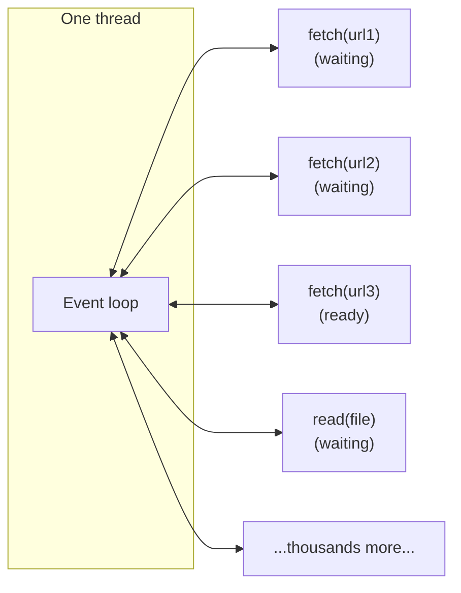

# Synchronous vs Asynchronous I/O

When code makes a call -- reads a file, queries a database, fetches a URL -- the call is either **synchronous** (the caller waits for the result before doing anything else) or **asynchronous** (the caller hands the work off and continues). The distinction shapes how a single program handles latency, how many slow operations one thread can drive, and how throughput scales when the work is dominated by waiting.

This page is about that distinction at the level of code running in one process. The same shape of problem reappears between services in a distributed system, but the solution and trade-offs there are different enough that they get their own page -- see [Pub/Sub and Messaging](02-pubsub-and-messaging.md).

---

## The Problem: Threads Waiting on I/O

CPU-bound work uses the CPU. I/O-bound work mostly waits. A typical HTTP request takes 100ms; the CPU is busy for maybe 1ms of that. The other 99ms is waiting for the network.

Synchronous I/O ties up a thread for the whole 100ms:

```python
def fetch_all(urls):
    results = []
    for url in urls:
        results.append(requests.get(url))   # blocks the thread for ~100ms
    return results
```

Three URLs → 300ms total → one thread idle 99% of that time. Scale this up: a web server handling 10,000 concurrent connections, each blocked on a slow downstream call, needs 10,000 threads. Threads are not free -- each one costs roughly 1-8 MB of stack memory, plus context-switching overhead the kernel pays every time the scheduler picks a new one to run. At a few thousand threads, throughput collapses, not because the CPU is saturated but because the scheduler is.

The throughput ceiling here is **not the CPU**. It is the cost of having many threads, almost all of which are doing nothing.

---

## The Fix: One Thread, Many Pending Operations

Asynchronous I/O lets a single thread drive many concurrent operations. The thread starts an I/O operation, registers a callback (or `await` point), and immediately moves on to other work. When the kernel signals that the I/O is done, the thread comes back and resumes that operation.

```python
import asyncio
import aiohttp

async def fetch_all(urls):
    async with aiohttp.ClientSession() as session:
        return await asyncio.gather(*(session.get(u) for u in urls))
```

All three requests are in flight together. Total time ≈ the slowest single request, not the sum. The thread is only doing work when there is actual work to do; while the network is busy, it drives other connections.

The thing that makes this work is the **event loop**. It maintains a queue of pending I/O operations, asks the OS which ones are ready (via `epoll`, `kqueue`, or `IOCP`), and resumes their coroutines one at a time. A single thread can drive tens of thousands of in-flight operations because each one only consumes thread time when it is actually making progress.



This is the same idea as a JavaScript runtime in the browser, Node.js on a server, Go's goroutines (with a different scheduler), and the C `select`/`poll`/`epoll` family. Different syntax, same property.

---

## What Async Doesn't Help With

Async I/O is for **I/O-bound** workloads. If the work is CPU-bound -- numerical computation, parsing, image processing -- the thread is busy the whole time, and async buys you nothing. You need actual parallelism (multiple threads or processes), not concurrency on one thread.

A useful split:

| Bottleneck | Right tool |
|---|---|
| Many concurrent slow I/O calls | Async I/O on a single thread |
| Heavy computation that uses one core | A worker thread or process pool |
| Both at once | Async loop *plus* a thread/process pool for CPU work |

In Python this distinction matters more than usual because the GIL prevents threads from running Python bytecode in parallel -- so threads only help for I/O, and CPU work needs `multiprocessing` or extension code.

---

## Awaiting Is Not Free

Async code is harder to reason about and harder to debug than synchronous code. The two main costs:

- **Function color.** In most languages, async functions can only be called from other async functions. A synchronous function in the middle of your stack can't call into the async world without bridging. This forces large parts of a codebase into one mode or the other.
- **Failure modes shift.** A synchronous exception unwinds the stack and lands somewhere obvious. An async exception in a fire-and-forget task can be silently swallowed if no one awaits the result. You need explicit machinery (cancellation, exception groups, supervisors) to stay safe.

The trade-off is the same one you make at every level of a system: **complexity in exchange for throughput under high concurrency**. If your program handles ten requests at a time, sync is fine and probably clearer. If it handles ten thousand, async is the only practical option.

---

## When Sync Is the Right Answer

- The program is single-purpose and not handling many concurrent operations: a script, a CLI tool, a batch job.
- The bottleneck is the CPU, not waiting.
- You only have a handful of in-flight I/O operations at a time and clarity matters more than throughput.

Don't reach for `async def` because it sounds more modern. The simpler tool wins until you have a measurable throughput problem.

---

## When Async Is the Right Answer

- A web server, proxy, or gateway that holds many open connections at once.
- A program that fans out many slow I/O calls in parallel (scraping, batch API calls, multi-source data fetching).
- A long-running daemon that has to react to many independent event streams (websockets, message queues, file watchers).

These are exactly the workloads where threads-per-operation breaks down.

---

## The Bridge to Distributed Systems

The pattern *concurrency on one thread instead of one thread per operation* is a code-level technique. Once you cross a network boundary -- two services on different machines -- the relevant trade-offs change:

- The "wait" is no longer 100ms of network I/O inside one process; it's a request to a service that may be down, slow, or overloaded.
- The "cost of waiting" is not just thread overhead but **coupling**: if you wait synchronously for another service, your availability becomes tied to theirs.
- The "fix" is not an event loop inside your process; it's a **message broker** between processes.

The vocabulary overlaps -- "non-blocking", "fire and forget", "the caller doesn't wait" -- but the failure modes, the durability requirements, and the architectural implications are different enough that messaging is treated as its own topic. See [Pub/Sub and Messaging](02-pubsub-and-messaging.md) for the architecture-level version.

What carries over is the underlying observation: **whenever the caller doesn't strictly need the result before continuing, blocking is a self-imposed constraint**. At the code level you remove it with an event loop. At the architecture level you remove it with a broker.

---

[← Back: Pub/Sub and Messaging](02-pubsub-and-messaging.md) | [Core Concepts Home](../README.md)
