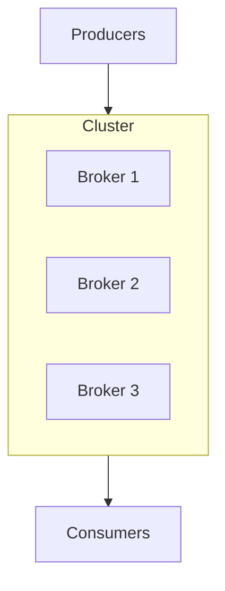
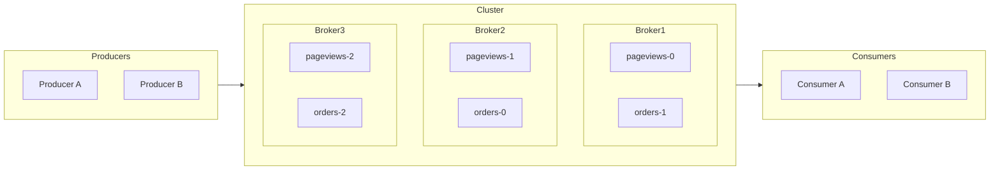

# Broker, Topic, Partition: The Kafka Model

Kafka has four building blocks. Almost everything else in Kafka -- producers, consumers, groups, replication, retention -- is a consequence of how those four blocks fit together. Once they click, the rest of Kafka stops being mysterious.

This chapter teaches the model generically, then names the Kafka pieces. Most concepts here transfer to other log-structured brokers (Pulsar, Kinesis, Redis Streams) with small renaming.

---

## The Core Idea: A Distributed, Append-Only Log

A Kafka **topic** is an append-only log. Producers append at the tail. Consumers read by remembering a position (an *offset*) and reading forward from there.

```
offset:  0    1    2    3    4    5    6    ...
         ┌────┬────┬────┬────┬────┬────┬────┐
record:  │ A  │ B  │ C  │ D  │ E  │ F  │ G  │  ← producers append here
         └────┴────┴────┴────┴────┴────┴────┘
                    ↑                    ↑
                 consumer X         consumer Y
                 (offset 2)         (offset 6)
```

That diagram alone explains four properties:

1. **Multiple consumers, independent positions.** Two consumers reading the same topic don't interfere -- each remembers its own offset. Adding a new consumer is free; it doesn't slow anyone else down.
2. **Replay is built in.** Consumer X can rewind to offset 0 and replay every record. The log is the source of truth.
3. **Order is preserved within the log.** Records are read in the order they were written.
4. **Storage is bounded by retention, not by consumer activity.** Records are deleted on a time/size policy, regardless of whether anyone read them.

This is fundamentally different from a "queue" model where messages are removed after consumption. In Kafka, the log persists; consumers track their own progress.

> **Core Concept:** This is the same idea as a write-ahead log -- see [Write-Ahead Logs](../../core-concepts/05-replication-and-availability/03-write-ahead-logs.md). Kafka is, essentially, a database's commit log exposed as the primary interface.

---

## The Scaling Problem

A single append-only log has a ceiling. One disk, one network card, one process -- eventually you saturate one of them. To scale beyond that ceiling, you have to split the log.

Kafka splits each topic into **partitions**. Each partition is itself an append-only log. The topic is the *logical* concept; the partition is the *physical* unit of work.

```
Topic: pageviews
├── Partition 0: [r0, r1, r2, r3, ...]
├── Partition 1: [r0, r1, r2, ...]
└── Partition 2: [r0, r1, r2, r3, r4, ...]
```

Each partition lives on one or more **brokers** (Kafka servers). A topic with 3 partitions across 3 brokers can absorb 3x the throughput of a single-partition topic, because the load is distributed.

> **Core Concept:** Splitting a logical dataset into independently-scaled physical units is exactly partitioning -- see [Partitioning Strategies](../../core-concepts/03-scaling/02-partitioning-strategies.md). Kafka's choice is hash-partitioning by key (default).

---

## Brokers: The Physical Layer

A **broker** is a Kafka server process. A **Kafka cluster** is some number of brokers (typically 3, 5, or more in production) cooperating.



Each broker stores some partitions on its local disk. When a producer wants to write to topic `pageviews`, partition 0, it sends the record to whichever broker owns that partition's *leader replica* (more on replicas in [Replication & ISR](05-replication-and-isr.md)). Brokers coordinate among themselves so producers and consumers don't have to know which broker holds what -- they discover it via cluster metadata.

This means: as you add brokers, you can spread more partitions across more disks and more network cards. Scaling is mostly "add a broker, rebalance partitions."

---

## How Records Land on Partitions

A producer publishing a record decides which partition it goes to. Three common strategies:

1. **By key (default when a key is given).** The producer hashes the record's key (typically `user_id`, `order_id`, etc.) modulo the partition count: `partition = hash(key) % num_partitions`. All records with the same key land on the same partition. **This guarantees ordering for a given key.**
2. **Round-robin / sticky (default when no key).** Records are spread across partitions roughly evenly. No per-key ordering.
3. **Custom partitioner.** The producer code computes the partition itself.

```python
# kafka-python style
producer.send("pageviews", key=b"user-42", value=b"...")  # always lands on the same partition
producer.send("pageviews", value=b"...")                  # round-robin / sticky
```

The choice of key is a **design decision with consequences**:

- All events for `user-42` are ordered (they're on the same partition, read in order).
- All events for `user-42` are processed by the same consumer (consumer group assignment is per-partition -- see next chapter).
- If one user dominates traffic, that partition gets hot -- partition skew. Pick a key with reasonable cardinality.

---

## Where Offsets Live

Each partition has its own monotonically-increasing offset, starting at 0:

```
Topic: pageviews
├── Partition 0: offsets 0..10000     ← consumer-A is at offset 4523
├── Partition 1: offsets 0..9876      ← consumer-A is at offset 9100
└── Partition 2: offsets 0..10500     ← consumer-A is at offset 0 (just joined)
```

Offsets are **not** unique across partitions. "Offset 100" only makes sense in the context of a specific partition.

A consumer's *position* is therefore a set: one offset per partition it's reading. When a consumer commits its progress, it commits each partition's offset independently. Kafka stores those commits in a special internal topic, `__consumer_offsets`.

---

## Retention: How Long Records Live

A partition's log doesn't grow forever. Each topic has a **retention policy**:

- **Time-based** (default): "keep records for 7 days." After 7 days, old segments are deleted from disk.
- **Size-based:** "keep up to 100 GB per partition." Older segments are deleted when the limit is hit.
- **Compaction (special case):** "keep only the latest record per key." Useful for treating the topic as a key-value snapshot.

Retention policy decouples *how long data is available* from *how fast consumers read*. A new consumer can replay the last 7 days of events. A slow consumer that falls behind by 8 days will start to miss data -- so monitor consumer lag.

---

## The Whole Picture



A topic spans multiple partitions; partitions are spread across brokers; producers append to partitions; consumers read from partitions and remember offsets. Everything else in Kafka is built on this picture.

---

## Tool-Agnostic Recap

Strip Kafka's name off and the model is:

| Concept | Kafka name | Pulsar name | Kinesis name |
|---|---|---|---|
| Logical event stream | Topic | Topic | Stream |
| Physical scaling unit | Partition | Partition | Shard |
| Server process | Broker | Broker | (managed) |
| Reader's position | Offset | MessageId | SequenceNumber |
| Persistent append-only log | Topic log | Managed Ledger | Stream |

Once you know the Kafka model, picking up another broker is mostly translation.

---

[← Previous: Where This Shows Up](../01-introduction/02-where-this-shows-up.md) | [Next: Producers and Consumers →](02-producers-and-consumers.md)
