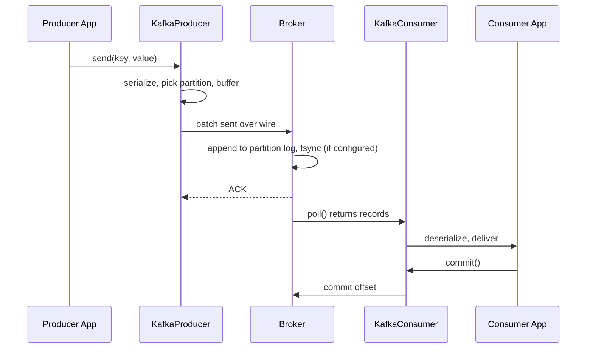

# Producers and Consumers

Now that you have the broker/topic/partition model, the next question is how code on either side actually gets records in and out. This chapter walks through the producer and consumer APIs -- what they do, what's happening under the hood, and the few configuration knobs that matter for the rest of this module.

We'll use `kafka-python` for the examples because that's what the project uses. Other languages (Java's official `KafkaProducer`, Go's `confluent-kafka-go`, etc.) have the same shape.

---

## The Producer

A producer is a long-lived client that appends records to topics. Its job is small: serialize a record, decide which partition it belongs to, batch records together for efficiency, and send them to the right broker.

```python
from kafka import KafkaProducer
import json

producer = KafkaProducer(
    bootstrap_servers="localhost:9092,localhost:9093,localhost:9094",
    key_serializer=lambda k: k.encode("utf-8"),
    value_serializer=lambda v: json.dumps(v).encode("utf-8"),
)

producer.send(
    "pageviews",
    key="user-42",
    value={"user_id": "user-42", "page": "/checkout", "ts": "2026-05-03T10:00:00Z"},
)
producer.flush()   # block until all in-flight records are acknowledged
```

A few things worth understanding from that snippet:

### Bootstrap servers

The `bootstrap_servers` list isn't "the brokers you'll send to." It's "any handful of brokers I can connect to so I can discover the rest of the cluster." Once connected, the producer fetches *cluster metadata* -- which broker leads which partition -- and routes records accordingly.

This is why production deployments list 3+ bootstrap servers: it's a startup-time fault-tolerance hedge. Once running, the producer talks to whichever brokers own the partitions it's writing to, regardless of which were in the bootstrap list.

### Serialization

Kafka itself stores raw bytes. It does not know what JSON is, or Avro, or Protobuf. The serializer is the producer's responsibility. Common choices:

- **JSON** — readable, widely supported, no schema enforcement. Fine for getting started.
- **Avro / Protobuf with a schema registry** — schema evolution, smaller payloads. Common in production.
- **Plain bytes / strings** — for log lines, raw events.

The streaming-clickstream project uses JSON.

### `send` is asynchronous

`producer.send` does not wait for the broker to confirm the write. It returns a `Future`. The record is queued in the producer's in-memory buffer, batched with others bound for the same partition, and shipped off in the background by an internal sender thread.

You force the wait with `producer.flush()` (block until everything in the buffer is acknowledged) or `producer.send(...).get(timeout=...)` (block on a single record). Both are useful, both are the **slow path** -- in steady state you want the async batching to keep going.

### Batching and `linger.ms`

The producer accumulates records bound for the same partition into a batch (default up to 16 KB). It ships the batch when:

- the batch is full, OR
- `linger.ms` milliseconds have passed since the first record arrived (default: 0).

Setting `linger.ms=10` means "wait up to 10ms to fill the batch before sending." On busy topics this dramatically improves throughput at the cost of 10ms extra latency. It's the producer-side knob you'll see most often.

---

## The Consumer

A consumer is also a long-lived client. It subscribes to one or more topics and pulls records.

```python
from kafka import KafkaConsumer
import json

consumer = KafkaConsumer(
    "pageviews",
    bootstrap_servers="localhost:9092,localhost:9093,localhost:9094",
    group_id="analytics-service",
    auto_offset_reset="earliest",   # or "latest"
    enable_auto_commit=False,
    value_deserializer=lambda b: json.loads(b.decode("utf-8")),
    key_deserializer=lambda b: b.decode("utf-8") if b else None,
)

for record in consumer:
    process(record.value)
    consumer.commit()    # explicitly mark "I'm done with this offset"
```

What's happening here:

### `group_id`

Consumers belong to a **consumer group**. The group is what lets multiple consumers cooperate to consume a topic in parallel -- partitions are distributed across the group's members. We'll cover this in [Consumer Groups & Rebalancing](03-consumer-groups-and-rebalancing.md). For now, just know: same `group_id` = "we share the work"; different `group_id` = "we're independent readers."

### `auto_offset_reset`

When a consumer joins a group for the first time -- no committed offsets exist yet -- where does it start reading?

- `earliest`: start from offset 0. Every record currently in the topic will be processed.
- `latest`: start from the tail. Only records produced *after* the consumer joined will be processed.

Most analytical pipelines use `earliest` (don't want to silently drop history). Most real-time alerting pipelines use `latest` (don't care about old events).

### The poll loop

The `for record in consumer:` form hides what's really happening. Underneath, the consumer is calling `poll()` repeatedly. Each `poll` returns a batch of records the broker has fetched and buffered locally. The consumer client also uses the poll cycle to send heartbeats to the broker -- if too long passes between polls, the broker thinks the consumer is dead and rebalances its partitions away.

That detail matters: **slow processing inside the loop can get you kicked out of the group**. We'll come back to it.

### Commits

`commit()` writes the consumer's current offset to Kafka's `__consumer_offsets` topic. This is the consumer saying "I've successfully processed everything up to here -- if I crash, restart me from this position."

Two commit strategies:

- **Auto-commit** (`enable_auto_commit=True`, the default): the client commits periodically (every 5 seconds) in the background. Easy, but you can lose work or duplicate work depending on timing.
- **Manual commit** (`enable_auto_commit=False`): you call `commit()` after processing. Gives you control over the at-least-once vs at-most-once behavior.

The choice is a **delivery guarantee** decision -- see [Delivery Guarantees](04-delivery-guarantees.md). For anything that matters, manual commit is the right answer.

---

## Producing and Consuming Together: The Round-Trip

End-to-end, a record's journey is:



The interesting properties of this picture:

- **Producer and consumer don't know about each other.** They both talk to the broker. They can be in different processes, different machines, different data centers, written in different languages.
- **The broker decouples timing.** The producer can be done sending before the consumer ever starts. Or the consumer can be reading from offset 0 long after the producer has stopped.
- **Failures on either side don't cascade.** If the producer dies, the consumer keeps consuming what's already in the log. If the consumer dies, the producer keeps producing -- the consumer will catch up when it returns.

That decoupling is the whole point of the broker-in-the-middle architecture from chapter 1.

---

## A Working Mental Model

For most code you'll write:

- The **producer** is a fire-and-forget appender. You hand it records and trust it to deliver them. The only thing you regularly think about is the key (which determines partition / ordering).
- The **consumer** is a pull-based reader of partitions. You read in a loop, process each record, and commit when safe. The thing you regularly think about is *when* to commit.

Everything else -- compression, batching, fetch sizes, session timeouts -- has reasonable defaults.

---

[← Previous: Broker, Topic, Partition Model](01-broker-topic-partition-model.md) | [Next: Consumer Groups and Rebalancing →](03-consumer-groups-and-rebalancing.md)
