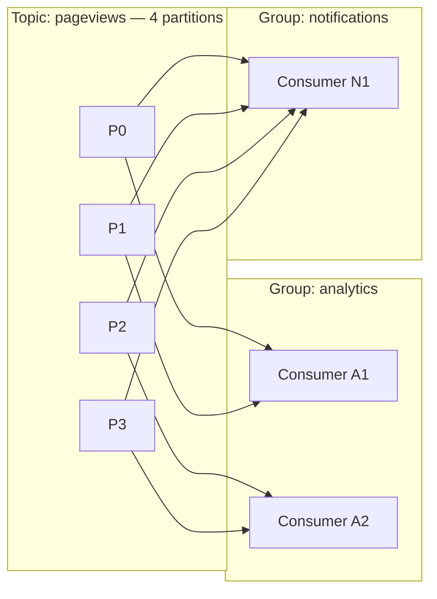
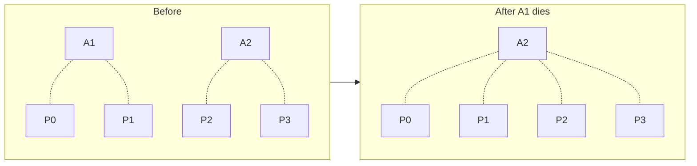

# Consumer Groups and Rebalancing

Partitions split a topic so that many machines can write and read in parallel. **Consumer groups** are how readers cooperate to share that work -- and how Kafka offers both pub/sub fan-out and queue-style point-to-point delivery using the same primitive.

This chapter is the conceptual heart of Kafka consumption. If you understand the partition-to-consumer mapping, you understand most operational questions about Kafka clients.

---

## What Is a Consumer Group?

A **consumer group** is a set of consumer processes that cooperate to consume a topic. The group has a name (`group_id`). Inside the group, **each partition is assigned to exactly one consumer**. Across groups, every group sees every record.



Two distinct properties from one diagram:

1. **Within `analytics`**, the 4 partitions are split between A1 and A2. Each partition's records go to exactly one of them. The group processes the topic in parallel; each record is handled once. **This is queue-style point-to-point delivery.**
2. **Across `analytics` and `notifications`**, both groups see all records independently. `notifications` has its own offsets. **This is fan-out / pub/sub.**

So consumer groups are how Kafka does pub/sub *and* queues at the same time, on the same topic, with no special configuration.

> **Core Concept:** This dual behavior is the consumer-group pattern from [Pub/Sub and Messaging Patterns](../../core-concepts/07-application-patterns/02-pubsub-and-messaging.md) — Kafka was the implementation that popularized it.

---

## Partition Assignment Rules

The fundamental constraint:

> **Each partition is assigned to one consumer in the group at any given time. A consumer can hold multiple partitions, but a partition is never split across consumers in the same group.**

Consequences:

- **Parallelism is bounded by partition count.** If a topic has 4 partitions, a group can usefully have at most 4 active consumers. A 5th consumer would sit idle, waiting for a partition.
- **Per-key ordering is preserved.** Records with the same key go to the same partition (producer side), and that partition is read by one consumer (consumer side). The consumer sees keys in the order they were produced.
- **Consumer count drives planning.** Want to scale up to 8 parallel consumers? Pick a partition count of 8 (or higher) when creating the topic. You can add partitions later but it disturbs key-to-partition mapping for new records.

Common rule of thumb: pick partition count = max parallelism you'd ever want, plus headroom. 12, 24, or 48 are common choices for medium-to-high-throughput topics.

---

## Rebalancing: When the Membership Changes

Consumers come and go. New ones start up; old ones crash; deployments restart fleets. Each time the group's membership changes, Kafka has to **rebalance** -- redistribute partitions across the new set of consumers.



The rebalance is coordinated by a special broker called the **group coordinator**. The protocol roughly:

1. A consumer joins or leaves (or fails to heartbeat in time).
2. The coordinator triggers a rebalance.
3. All members of the group "pause" (stop fetching) and re-register.
4. The coordinator runs a partition-assignment strategy and tells each consumer its new partitions.
5. Consumers resume from their last committed offsets on the partitions they were assigned.

While a rebalance is in progress, **no records are processed**. Old Kafka used "stop-the-world" rebalances that could last seconds. Modern Kafka uses **incremental cooperative rebalancing** by default, which moves only the affected partitions and lets others keep working.

---

## What Triggers a Rebalance?

The big four:

1. **A consumer joins** the group (new pod started).
2. **A consumer leaves** cleanly (it called `consumer.close()`).
3. **A consumer fails to heartbeat** in time. The coordinator declares it dead and reassigns its partitions. This is the painful one -- silent crashes look the same as "took too long inside the poll loop."
4. **Topic metadata changes** -- e.g. partitions added.

The session-timeout / heartbeat behavior is worth pinning down:

- **`session.timeout.ms`** (default 45s): the coordinator considers a consumer dead if it hasn't seen a heartbeat in this long.
- **`heartbeat.interval.ms`** (default 3s): the consumer sends a heartbeat this often (in a background thread, on most clients).
- **`max.poll.interval.ms`** (default 5 min): if `poll()` is not called again within this time, the consumer is removed from the group.

The trap: heartbeats run on a background thread, but if your processing inside the poll loop takes longer than `max.poll.interval.ms`, you get kicked out anyway. The fix is either to process faster, fetch fewer records per `poll()`, or hand off processing to a worker pool and keep polling.

---

## Sticky vs Range vs Round-Robin Assignment

The coordinator runs an *assignment strategy* to map partitions to consumers. Three you'll meet:

- **Range** (legacy default): for each topic, divide partitions into contiguous ranges per consumer. Fast but can be unbalanced when consumers subscribe to multiple topics.
- **Round-robin**: spread partitions evenly across consumers. Better balance, but a rebalance can re-shuffle most assignments.
- **Cooperative sticky** (modern default): minimize movement -- keep existing assignments when possible, only move partitions from consumers that have lost them. This is what makes incremental rebalancing fast.

For most projects, the default works fine. The thing to remember is that *after* a rebalance, your partitions might be different ones than before -- so your consumer must not cache state keyed by partition without revalidating it.

---

## Offsets Are Per-Partition, Per-Group

An important consequence of all this: an offset is owned by `(topic, partition, group_id)`. Two different groups read independently. A new group starts from `auto_offset_reset` (earliest or latest), regardless of what other groups have done.

```
__consumer_offsets:
  (pageviews, 0, analytics)      = 4523
  (pageviews, 1, analytics)      = 9100
  (pageviews, 0, notifications)  = 1200    ← independent of analytics
  (pageviews, 1, notifications)  = 9100
```

This is why "make a new consumer to replay from the beginning" is so easy in Kafka -- just give it a new `group_id` and `auto_offset_reset=earliest`.

---

## Practical Patterns

A few recurring shapes:

### Single consumer, single partition: ordered processing

If you need *strict global ordering* of every event, the topic gets one partition and the group has one consumer. Throughput is bounded by what one consumer can do, but ordering is total.

### Many consumers, partitions sized for parallelism

The common case. Pick partition count = max desired parallelism. Use a meaningful key (e.g. `user_id`) so per-user events stay ordered and stay on the same consumer.

### Multiple groups for fan-out

Different downstream systems each want a copy of the stream. Each system gets its own group; each reads independently with its own offsets and lag.

### Disposable groups for replay

Need to reprocess history? Spin up a new consumer with a fresh `group_id` and `auto_offset_reset=earliest`. It reads from offset 0 and writes its results wherever you want. Throw the group away after.

---

[← Previous: Producers and Consumers](02-producers-and-consumers.md) | [Next: Delivery Guarantees →](04-delivery-guarantees.md)
