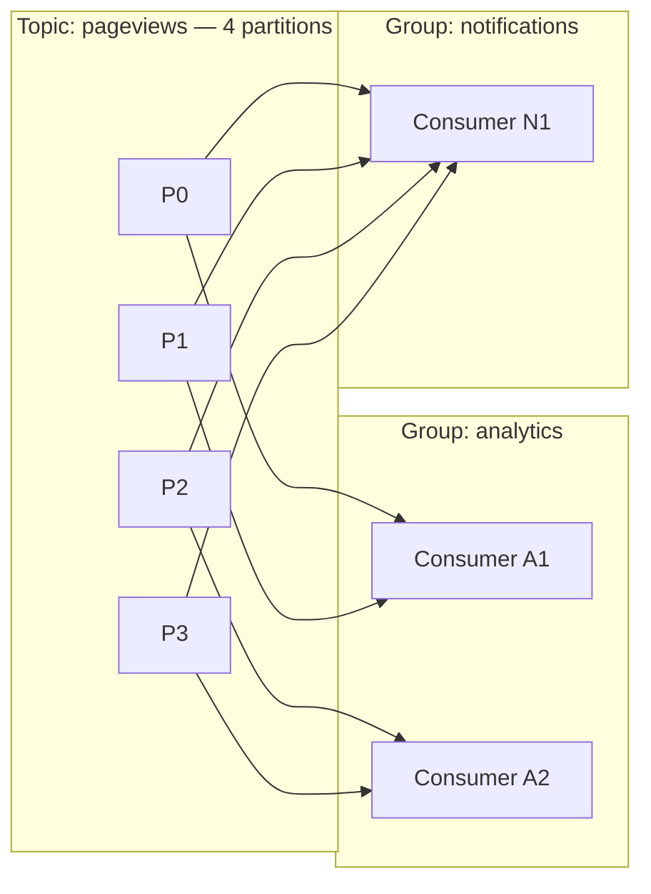
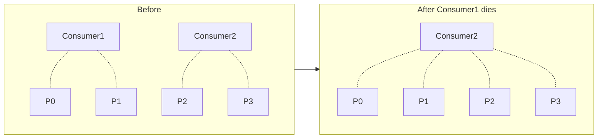

---
kernelspec:
  name: python3
  display_name: Python 3
  language: python
---
# Consumer Groups and Rebalancing

Partitions split a topic so that many machines can write and read in parallel. **Consumer groups** are how readers cooperate to share that work -- and how Kafka offers both pub/sub fan-out and queue-style point-to-point delivery using the same primitive.

This chapter is the conceptual heart of Kafka consumption. If you understand the partition-to-consumer mapping, you understand most operational questions about Kafka clients.

---

## What Is a Consumer Group?

A **consumer group** is a set of consumer processes that cooperate to consume a topic. The group has a name (`group_id`). Inside the group, **each partition is assigned to exactly one consumer**. Across groups, every group sees every record.



Two distinct properties from one diagram:

1. **Within `analytics`**, the 4 partitions are split between A1 and A2. Each partition's records go to exactly one of them. The group processes the topic in parallel; each record is handled once. **This is queue-style point-to-point delivery.**
2. **Across `analytics` and `notifications`**, both groups see all records independently. `notifications` has its own offsets. **This is fan-out / pub/sub.**

So consumer groups are how Kafka does pub/sub *and* queues at the same time, on the same topic, with no special configuration.

We can see partition assignment in action. Spin up two consumers in the same group on a 4-partition topic and ask each which partitions it owns:

**Step 1 — set up the topic and produce some data.**

```{code-cell} python
import time
from kafka import KafkaConsumer, KafkaProducer, TopicPartition
from kafka.admin import KafkaAdminClient, NewTopic
from kafka.errors import TopicAlreadyExistsError

BOOTSTRAP = "kafka-1:9092,kafka-2:9092,kafka-3:9092"
TOPIC = "demo-consumer-groups"
GROUP = "demo-cg-analytics"
NUM_PARTITIONS = 4
NUM_RECORDS = 400

admin = KafkaAdminClient(bootstrap_servers=BOOTSTRAP)
try:
    admin.create_topics([NewTopic(name=TOPIC, num_partitions=NUM_PARTITIONS, replication_factor=3)])
except TopicAlreadyExistsError:
    pass

producer = KafkaProducer(bootstrap_servers=BOOTSTRAP)
for _ in range(NUM_RECORDS):
    producer.send(TOPIC, value=b"v")
producer.flush()
producer.close()
print(f"topic {TOPIC!r} ready with {NUM_PARTITIONS} partitions; produced {NUM_RECORDS} records")
```

**Step 2 — a small helper.** `wait_for_assignment` polls until the group rebalance hands every consumer its partitions. (Rebalance only happens inside `poll()`, so we *have* to call it to make the join occur.)

```{code-cell} python
def wait_for_assignment(consumers, timeout_s=15):
    deadline = time.time() + timeout_s
    while time.time() < deadline:
        for c in consumers:
            c.poll(timeout_ms=200)
        if all(c.assignment() for c in consumers):
            return
    raise TimeoutError("rebalance did not settle in time")

print("helper defined: wait_for_assignment")
```

**Step 3 — start two consumers in the same group and watch the rebalance hand out partitions.** Different `max_poll_records` per consumer so we can make their committed offsets diverge later.

```{code-cell} python
c1 = KafkaConsumer(TOPIC, bootstrap_servers=BOOTSTRAP, group_id=GROUP, client_id="c1",
                   auto_offset_reset="earliest", enable_auto_commit=False,
                   max_poll_records=200)
c2 = KafkaConsumer(TOPIC, bootstrap_servers=BOOTSTRAP, group_id=GROUP, client_id="c2",
                   auto_offset_reset="earliest", enable_auto_commit=False,
                   max_poll_records=50)

wait_for_assignment([c1, c2])
a1 = sorted(tp.partition for tp in c1.assignment())
a2 = sorted(tp.partition for tp in c2.assignment())
print(f"c1 owns partitions {a1}")
print(f"c2 owns partitions {a2}")
```

**Step 4 — consume one batch from each consumer, then commit.** We `seek_to_beginning` first so the committed offset reflects only what this cell consumed, not the warm-up polls done during the rebalance.

```{code-cell} python
c1.seek_to_beginning()
c2.seek_to_beginning()

r1 = c1.poll(timeout_ms=2000)
r2 = c2.poll(timeout_ms=2000)
n1 = sum(len(v) for v in r1.values())
n2 = sum(len(v) for v in r2.values())
print(f"c1 fetched {n1} records (cap=200)")
print(f"c2 fetched {n2} records (cap=50)")

# Auto-commit is disabled, so commit explicitly. Each consumer writes offsets only
# for its own partitions in __consumer_offsets[(topic, partition, group)].
c1.commit()
c2.commit()
```

> **Teaching note — `max_poll_records` is a cap, not a target.** A single `poll()` returns whatever the consumer's per-broker fetcher has buffered *right now*, sliced down to `max_poll_records`. It does **not** wait until the buffer fills to the cap. Each broker leader replies to its own `FetchRequest` independently, so a `poll()` right after `seek_to_beginning` typically catches only the fastest leader's response — you'll often see *fewer* records than the cap, sometimes from only a subset of the assigned partitions. Real consumer loops poll repeatedly for exactly this reason; one `poll()` is never a contract for "up to N records." `timeout_ms` is "how long to block waiting for the first record," not "how long to collect."

**Step 5 — inspect committed offsets via the admin client.** c1's rows and c2's rows live side-by-side in `__consumer_offsets`; neither consumer touches the other's partitions.

```{code-cell} python
high_water = c1.end_offsets([TopicPartition(TOPIC, p) for p in range(NUM_PARTITIONS)])
committed = admin.list_consumer_group_offsets(GROUP)

for tp in sorted(committed, key=lambda tp: tp.partition):
    owner = "c1" if tp.partition in a1 else "c2"
    print(f"  partition {tp.partition} ({owner}): committed {committed[tp].offset} / {high_water[tp]}")
```

**Step 6 — clean up.**

```{code-cell} python
c1.close(); c2.close()
admin.delete_topics([TOPIC])
admin.close()
print(f"closed consumers and deleted topic {TOPIC!r}")
```

> **Core Concept:** This dual behavior is the consumer-group pattern from [Pub/Sub and Messaging Patterns](../../core-concepts/07-application-patterns/02-pubsub-and-messaging.md) — Kafka was the implementation that popularized it.

---

## Partition Assignment Rules

The fundamental constraint:

> **Each partition is assigned to one consumer in the group at any given time. A consumer can hold multiple partitions, but a partition is never split across consumers in the same group.**

Consequences:

- **Parallelism is bounded by partition count.** If a topic has 4 partitions, a group can usefully have at most 4 active consumers. A 5th consumer would sit idle, waiting for a partition.
- **Per-key ordering is preserved.** Records with the same key go to the same partition (producer side), and that partition is read by one consumer (consumer side). The consumer sees keys in the order they were produced.
- **Consumer count drives planning.** Want to scale up to 8 parallel consumers? Pick a partition count of 8 (or higher) when creating the topic. You can add partitions later but it disturbs key-to-partition mapping for new records.

Common rule of thumb: pick partition count = max parallelism you'd ever want, plus headroom. 12, 24, or 48 are common choices for medium-to-high-throughput topics.

---

## Rebalancing: When the Membership Changes

Consumers come and go. New ones start up; old ones crash; deployments restart fleets. Each time the group's membership changes, Kafka has to **rebalance** -- redistribute partitions across the new set of consumers.



The rebalance is coordinated by a special broker called the **group coordinator**. The protocol roughly:

1. A consumer joins or leaves (or fails to heartbeat in time).
2. The coordinator triggers a rebalance.
3. Members re-register with the coordinator.
4. The coordinator runs a partition-assignment strategy and tells each consumer its new partitions.
5. Consumers resume from their last committed offsets on the partitions they were assigned.

How disruptive step 3 is depends on the protocol in use:

- **Eager rebalancing (old default).** *Every* consumer in the group revokes *all* its partitions before re-joining. Until the coordinator hands assignments back out, **no records are processed anywhere in the group** — a true stop-the-world pause that could last seconds.
- **Incremental cooperative rebalancing (modern default).** Only the partitions that actually need to move are revoked; every other partition keeps being consumed throughout. The group as a whole never fully pauses — just the small subset that's changing hands.

So the "no records processed" property applies *only* to the partitions involved in the move under cooperative rebalancing, and to the whole group under the legacy eager protocol.

---

## What Triggers a Rebalance?

1. **A consumer joins** the group (new pod started).
2. **A consumer leaves** cleanly (it called `consumer.close()`).
3. **A consumer fails to heartbeat** in time. The coordinator declares it dead and reassigns its partitions. This is the painful one -- silent crashes look the same as "took too long inside the poll loop." This is the case the diagram above illustrates: Consumer1 has died.
4. **Topic metadata changes** -- e.g. partitions added.

> **What about broker failures?** A broker crash does **not** trigger a consumer-group rebalance. Partitions are replicated, so when a broker dies, the partition *leader* moves to another replica and consumers transparently re-fetch from the new leader. The group's partition-to-consumer assignment stays untouched. The one indirect case: if the failed broker happened to be the **group coordinator** for that group, the coordinator role migrates to another broker and consumers re-discover it — a brief blip, but again the assignment isn't reshuffled. Rebalancing is about group *membership* changing, not about cluster topology changing.

The session-timeout / heartbeat behavior is worth pinning down:

- **`session.timeout.ms`** (default 45s): the coordinator considers a consumer dead if it hasn't seen a heartbeat in this long.
- **`heartbeat.interval.ms`** (default 3s): the consumer sends a heartbeat this often (in a background thread, on most clients).
- **`max.poll.interval.ms`** (default 5 min): if `poll()` is not called again within this time, the consumer is removed from the group.

The trap: heartbeats run on a background thread, but if your processing inside the poll loop takes longer than `max.poll.interval.ms`, you get kicked out anyway. The fix is either to process faster, fetch fewer records per `poll()`, or hand off processing to a worker pool and keep polling.

---

## Sticky vs Range vs Round-Robin Assignment

The coordinator runs an *assignment strategy* to map partitions to consumers. Three you'll meet:

- **Range** (legacy default): for each topic, divide partitions into contiguous ranges per consumer. Fast but can be unbalanced when consumers subscribe to multiple topics.
- **Round-robin**: spread partitions evenly across consumers. Better balance, but a rebalance can re-shuffle most assignments.
- **Cooperative sticky** (modern default): minimize movement -- keep existing assignments when possible, only move partitions from consumers that have lost them. This is what makes incremental rebalancing fast.

For most projects, the default works fine. The thing to remember is that *after* a rebalance, your partitions might be different ones than before -- so your consumer must not cache state keyed by partition without revalidating it.

---

## Offsets Are Per-Partition, Per-Group

An important consequence of all this: an offset is owned by `(topic, partition, group_id)`. Two different groups read independently. A new group starts from `auto_offset_reset` (earliest or latest), regardless of what other groups have done.

```
__consumer_offsets:
  (pageviews, 0, analytics)      = 4523
  (pageviews, 1, analytics)      = 9100
  (pageviews, 0, notifications)  = 1200    ← independent of analytics
  (pageviews, 1, notifications)  = 9100
```

This is why "make a new consumer to replay from the beginning" is so easy in Kafka -- just give it a new `group_id` and `auto_offset_reset=earliest`.

---

## Practical Patterns

A few recurring shapes:

#### Single consumer, single partition: ordered processing

If you need *strict global ordering* of every event, the topic gets one partition and the group has one consumer. Throughput is bounded by what one consumer can do, but ordering is total.

#### Many consumers, partitions sized for parallelism

The common case. Pick partition count = max desired parallelism. Use a meaningful key (e.g. `user_id`) so per-user events stay ordered and stay on the same consumer.

#### Multiple groups for fan-out

Different downstream systems each want a copy of the stream. Each system gets its own group; each reads independently with its own offsets and lag.

#### Disposable groups for replay

Need to reprocess history? Spin up a new consumer with a fresh `group_id` and `auto_offset_reset=earliest`. It reads from offset 0 and writes its results wherever you want. Throw the group away after.

---

> **Hands-on now — Stage 1 Part B.** Switch to `streaming-clickstream/stages/01-kafka-basics/lesson.md` and complete **Part B (consumer)**. Run `pytest tests/test_stage1.py -v` -- both `test_part_a` and `test_part_b` should be green. That closes Session 1.

---

[← Previous: Producers and Consumers](02-producers-and-consumers.md) | [Next: Delivery Guarantees →](04-delivery-guarantees.md)
