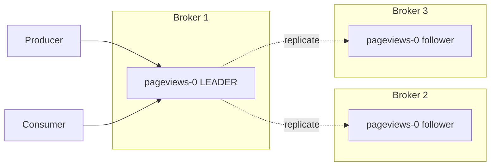

---
kernelspec:
  name: python3
  display_name: Python 3
  language: python
---
# Replication and the In-Sync Replica Set

A single broker is a single point of failure. The disk fails, the process crashes, the rack loses power -- and any partition that lived only on that broker is gone. Real Kafka clusters run with replication so partitions survive broker loss without data loss or downtime.

This chapter covers how Kafka replicates partitions, what the **in-sync replica set (ISR)** is, and how the producer setting `acks` interacts with it to choose between durability and availability.

> **Core Concept:** For the cross-tool theory, see [Replication Patterns](../../core-concepts/05-replication-and-availability/01-replication-patterns.md). Kafka uses leader-based replication, the most common model.

---

## Replicas: Multiple Copies of Each Partition

Each partition has a configurable **replication factor** -- how many copies of it exist across the cluster. Production defaults are typically 3.



For each partition, one replica is the **leader** and the others are **followers**:

- All reads and writes go to the leader.
- Followers continuously pull from the leader to stay caught up.
- If the leader broker dies, a follower is promoted to leader.

Followers are not load balancers. They exist purely for redundancy. (Reading from followers was added in Kafka 2.4 specifically for cross-rack latency optimization, but it's not the default.)

Kafka spreads leaders across brokers when assigning partitions, so each broker leads roughly the same number of partitions. This balances the read+write load even though only leaders serve traffic.

---

## The In-Sync Replica Set (ISR)

A follower is **in sync** if it has caught up to the leader recently -- specifically, within `replica.lag.time.max.ms` (default 30s). The set of in-sync replicas (including the leader) is the **ISR**.

```
Partition pageviews-0:
  Leader:    Broker 1, log up to offset 10000
  Followers: Broker 2 at offset 10000  ← in sync
             Broker 3 at offset  9985  ← in sync (within lag window)
             Broker 4 at offset  6000  ← OUT of sync, removed from ISR
```

Why does it matter? Because the ISR is what determines:

1. **Which followers are eligible to become leader** if the current leader fails.
2. **When the producer's acknowledgement is sent** (with `acks=all`).
3. **Whether the partition can accept writes at all** (with `min.insync.replicas`).

A follower that falls out of the ISR is not lost -- it's still trying to catch up. But it's not counted toward durability or election eligibility until it's caught up.

Let's create a replicated topic and ask the cluster who the leader, replicas, and ISR are for each partition:

```{code-cell} python
from kafka.admin import KafkaAdminClient, NewTopic
from kafka.errors import TopicAlreadyExistsError

BOOTSTRAP = "kafka-1:9092,kafka-2:9092,kafka-3:9092"
TOPIC = "demo-replication-isr"

admin = KafkaAdminClient(bootstrap_servers=BOOTSTRAP)
try:
    admin.create_topics([NewTopic(name=TOPIC, num_partitions=3, replication_factor=3)])
except TopicAlreadyExistsError:
    pass

import time; time.sleep(1)   # let metadata propagate
for t in admin.describe_topics([TOPIC]):
    print(f"topic: {t['topic']}")
    for p in t["partitions"]:
        print(f"  partition {p['partition']}: "
              f"leader=broker-{p['leader']} "
              f"replicas={p['replicas']} "
              f"isr={p['isr']}")

admin.delete_topics([TOPIC])
admin.close()
```

In a healthy 3-broker cluster you'll see `replicas` and `isr` matching for every partition — every replica is caught up. Stop a broker and the same call would show that broker missing from the ISR (it would still be in `replicas`).

---

## `acks`: The Producer's Durability Knob

The producer setting `acks` controls *when the leader confirms a write*:

- **`acks=0`** -- "fire and forget." Producer doesn't wait for any acknowledgement. Fastest, weakest. Records can be silently lost.
- **`acks=1`** -- the leader confirms as soon as it has written to its local log. If the leader crashes before any follower replicates, the record is lost.
- **`acks=all`** (also written `acks=-1`) -- the leader confirms only after **all replicas in the ISR** have written. Strongest durability.

`acks=all` is what you want for anything that matters. Combined with idempotence (the previous chapter), it gives exactly-once-write to the partition log.

---

## `min.insync.replicas`: The Safety Floor

`acks=all` says "wait for the ISR" -- but the ISR can shrink. If two of three followers are out of sync, the ISR has only one member (the leader), and `acks=all` becomes effectively `acks=1`.

`min.insync.replicas` is the topic-level setting that says "if the ISR is smaller than N, refuse writes." This is the durability floor: it makes sure you can never write a record that has fewer than N copies.

A common production setup:

```
replication.factor = 3
min.insync.replicas = 2
acks = all
```

Read: "every partition has 3 replicas; refuse writes unless at least 2 are in sync; producer waits for the full ISR to acknowledge." This survives **one broker loss with no data loss and no downtime**, and detects two-broker loss as an unavailability rather than silent corruption.

---

## The Durability/Availability Trade-Off

`min.insync.replicas` is exactly the [quorum knob](../../core-concepts/04-distributed-systems/04-quorum-and-tunable-consistency.md). Higher values give stronger durability but lower availability:

| `replication.factor` | `min.insync.replicas` | Durability | Availability under broker loss |
|---|---|---|---|
| 3 | 1 | Weak (single-copy windows possible) | Survives 2 broker losses, keeps writing |
| 3 | 2 | Strong (≥2 copies always) | Survives 1 broker loss, refuses writes during 2-broker loss |
| 3 | 3 | Strongest (all replicas) | Refuses writes if even 1 broker is down |

Production typically picks the middle row. The point of replication is to survive failure; if `min.insync.replicas` equals `replication.factor`, you have replication without fault tolerance for writes.

---

## What Happens When the Leader Dies

Sequence of events:

1. The leader broker becomes unreachable (crash, network partition, rack power loss).
2. Other brokers detect this via the cluster controller's heartbeat protocol.
3. The controller picks a new leader from the **current ISR** (preferring the head of the list -- Kafka tracks "preferred leaders" for balanced load).
4. Clients receive a metadata-update response on their next request and start sending to the new leader.
5. When the failed broker recovers, it rejoins as a follower and catches up. Eventually it may be reassigned as preferred leader (Kafka has a `preferred-leader-election` operation).

This is automatic. From the producer's view there's a brief surge in latency during the metadata refresh. From the consumer's view, much the same -- they just keep reading from the new leader.

---

## Unclean Leader Election

Two ways to handle a situation where **the entire ISR is gone** but a non-ISR replica is still alive:

- **Clean leader election** (default since Kafka 0.11, `unclean.leader.election.enable=false`): refuse to elect a leader. The partition is unavailable until an ISR member returns. **No data loss, possible extended outage.**
- **Unclean leader election** (`unclean.leader.election.enable=true`): elect the most-recent non-ISR replica. **Restored availability, possible data loss** -- whatever the ISR had that the elected replica didn't is gone forever.

For anything that matters, leave it off. The trade-off is "preserve correctness even at the cost of write availability" -- which is what you want for an event log that's the source of truth for downstream systems.

---

## Why This Matters for the Multi-Node Lab

In the project lab we run a 3-broker cluster. Pick a topic with `replication.factor=3` and `min.insync.replicas=2`, and you can:

- `docker stop kafka-2` and watch consumers and producers continue without missing a beat.
- `docker stop kafka-2 kafka-3` and observe that producers with `acks=all` now block (`min.insync.replicas` floor not met) while existing consumers keep reading.
- Restart the brokers and watch them rejoin and re-sync.

That's the behavior worth seeing once -- it's the difference between "we have a backup" and "we have fault tolerance."

---

## Quick Reference

| Setting | Where | What it controls |
|---|---|---|
| `replication.factor` | Topic | Total copies per partition |
| `min.insync.replicas` | Topic / broker default | Floor on ISR size for writes |
| `acks` | Producer | When the producer's send is acknowledged |
| `unclean.leader.election.enable` | Topic | Whether to lose data to restore availability |
| `replica.lag.time.max.ms` | Broker | Lag threshold for falling out of ISR |

---

> **Hands-on now — Stage 2 Part B.** Switch to `streaming-clickstream/stages/02-spark-ingest/lesson.md` and complete **Part B (parquet sink + checkpoint)**. Run `pytest tests/test_stage2.py -v` -- both parts should be green. That closes Session 2.

---

[← Previous: Delivery Guarantees](04-delivery-guarantees.md) | [Next: Multi-Node Deployment →](06-multi-node-deployment.md)
