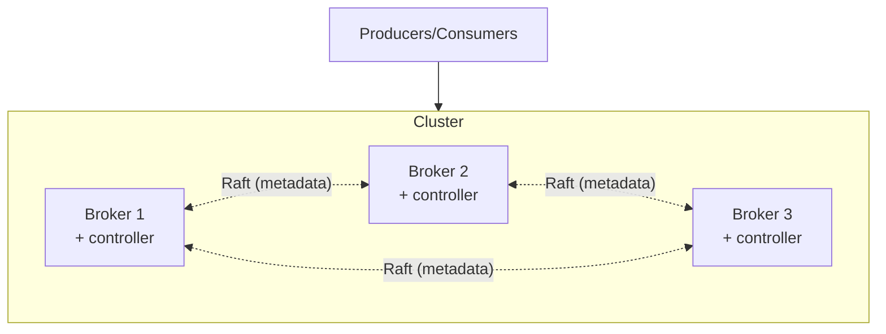

# Multi-Node Deployment

Kafka is built for scale -- not as an afterthought, but as the central architectural choice. The whole partition / replica / broker model exists so a cluster can be expanded by adding boxes. This chapter walks through what a multi-node cluster actually looks like, what KRaft means, and *why* this design scales.

---

## Why Multi-Node?

A single broker has three ceilings:

- **Disk I/O:** one set of disks can only do so many writes per second.
- **Network:** one NIC can only push so many bytes per second.
- **CPU:** one process can only handle so many connections and so much serialization work.

Production workloads brush all three. LinkedIn -- the company that built Kafka -- runs clusters that handle trillions of records per day across hundreds of brokers. The same architecture that runs on a 3-broker laptop cluster scales linearly to those numbers, because of the partition model.

The key property: **adding a broker adds capacity proportionally**. Throughput scales with broker count for as long as your topic's partition count keeps up.

---

## What Used to Run the Coordination: ZooKeeper

For the first decade of Kafka's life, every cluster had two kinds of nodes:

- **Brokers** -- the data plane. Hold partitions, serve reads and writes.
- **ZooKeeper ensemble** -- the control plane. Tracked broker membership, partition assignments, leader elections, and configuration.

This worked, but it was a separate distributed system to run. Two kinds of clusters to monitor, two consensus protocols to understand, two upgrade cycles. ZooKeeper also became the bottleneck for the largest deployments -- metadata change rates ran up against its throughput limits.

You may still see this in older clusters, but new deployments use **KRaft**.

---

## KRaft: Kafka's Self-Hosted Metadata

**KRaft** (KRaft = Kafka Raft) replaces ZooKeeper with metadata stored in Kafka itself, replicated by an internal Raft consensus protocol. The same brokers that hold partition data also (collectively) hold cluster metadata.



A few nodes in the cluster (typically 3 or 5) are designated **controllers**. They form the metadata Raft quorum. The rest are pure brokers. In a small cluster, all nodes can be both broker and controller -- which is how the lab is configured.

What KRaft buys:

- **One system to operate.** No ZooKeeper ensemble to provision, monitor, upgrade, secure.
- **Faster metadata operations.** Topic creation, partition reassignment, leader changes are all faster.
- **Higher partition limits.** Clusters with millions of partitions become practical.
- **Faster recovery.** Controller fail-over takes seconds rather than tens of seconds.

KRaft has been the default for new deployments since Kafka 3.3 (2022). For this course we use KRaft only -- the lab cluster has no ZooKeeper.

---

## What a Cluster Actually Looks Like

A 3-broker KRaft cluster, the kind we run in the lab:

```
kafka-1   broker_id=1   roles=broker,controller   port 9092
kafka-2   broker_id=2   roles=broker,controller   port 9093
kafka-3   broker_id=3   roles=broker,controller   port 9094

Topic: pageviews   partitions=6   replication.factor=3
  partition 0: leader=kafka-1   replicas=[1,2,3]   isr=[1,2,3]
  partition 1: leader=kafka-2   replicas=[2,3,1]   isr=[2,3,1]
  partition 2: leader=kafka-3   replicas=[3,1,2]   isr=[3,1,2]
  partition 3: leader=kafka-1   replicas=[1,3,2]   isr=[1,3,2]
  partition 4: leader=kafka-2   replicas=[2,1,3]   isr=[2,1,3]
  partition 5: leader=kafka-3   replicas=[3,2,1]   isr=[3,2,1]
```

Six partitions, three brokers. Each partition has 3 replicas spread across all brokers. Leaders are spread evenly -- kafka-1, -2, and -3 each lead 2 partitions. Reads and writes are balanced across the cluster naturally.

Inspect this in the lab with:

```bash
docker exec kafka-1 kafka-topics.sh --describe --topic pageviews --bootstrap-server kafka-1:9092
```

---

## Adding a Broker

Suppose traffic doubles. Add a fourth broker:

1. Provision `kafka-4`, point it at the cluster's controller quorum, and start it.
2. The controller adds it to the cluster metadata.
3. **Existing partitions don't move automatically.** kafka-4 sits idle.
4. Run `kafka-reassign-partitions.sh` to compute and apply a new assignment that includes kafka-4.
5. Kafka migrates partitions in the background while continuing to serve traffic.

After the migration:

```
kafka-1: leads 2 partitions (was 2)
kafka-2: leads 2 partitions (was 2)
kafka-3: leads 1 partition  (was 2)
kafka-4: leads 1 partition  (was 0)
```

Now the load is across 4 brokers. Repeat for each broker added.

This is what "scales horizontally" actually means in Kafka: new boxes share the load by holding a share of partitions and leading a share of them.

---

## Why This Scales So Well

Two architectural reasons:

1. **No coordination per record.** Producers and consumers each talk directly to the leader for their partition. There is no central path through which every record flows. The cluster's throughput is the sum of per-partition throughputs.
2. **Sequential disk I/O.** Each partition is an append-only log. Writes are sequential, which is the disk operation modern hardware does fastest -- often 10x faster than random writes. A single broker on commodity hardware can absorb hundreds of MB/s.

Combined, these mean you rarely run into a Kafka throughput problem you can't solve by adding partitions and brokers. The problems you do run into are usually elsewhere: producer batching, consumer processing speed, or downstream sinks.

---

## Rack Awareness

Production clusters span multiple racks (or AZs in the cloud). Kafka's **rack-awareness** ensures partition replicas land in different racks:

```
rack=us-east-1a:  kafka-1, kafka-4
rack=us-east-1b:  kafka-2, kafka-5
rack=us-east-1c:  kafka-3, kafka-6
```

With `replication.factor=3` and rack-aware assignment, every partition has one replica per rack. A whole rack going down still leaves an in-sync replica per partition.

Set `broker.rack=us-east-1a` (etc.) in each broker's config, and Kafka does the rest.

---

## What This Means for the Project

For the lab and the project, the cluster is 3 brokers, all on one machine, all in one "rack." That's enough to demonstrate:

- Topic creation with `partitions=6, replication.factor=3`.
- The describe command showing leaders spread across brokers.
- `docker stop kafka-2` and watching the partition leadership move.
- `docker start kafka-2` and watching it rejoin and re-sync.

Production clusters look the same, just with more brokers, more racks, and the same commands. The model doesn't change.

---

[← Previous: Replication and ISR](05-replication-and-isr.md) | [Next: Advanced Features Overview →](07-advanced-features-overview.md)
