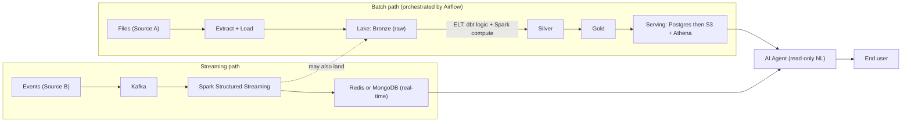

# Anchor Project — Specification (v0.2)

The single project that is built **incrementally across the whole course**. Each module contributes one more piece, so by the end the student has a complete, real-world data platform. This spec defines the **technical shape and requirements only** — the concrete dataset, domain, and business case are intentionally left open (see §2).

---

## 1. Purpose
- Be the spine that ties every module together (kills the "fragmented islands" problem).
- Mirror a real production data platform: batch + streaming ingestion, ELT transformation, warehousing, real-time serving, and an AI consumption layer.
- Grow tech-by-tech as the course progresses, so each tool is learned *in context* of one evolving system.
- Produce a portfolio-grade artifact the student can present and defend in interviews.

## 2. Domain & dataset — DEFERRED
The business case, dataset, and logic are **not fixed in this spec**. Whatever is chosen must satisfy these structural constraints:
- **Two related sources** that share a common entity/key so they can be joined/enriched:
  - **Source A — batch**: arrives as **files** (e.g., CSV/JSON/Parquet) on a schedule.
  - **Source B — streaming**: arrives as **events** about the *same entities* as Source A.
- Enough volume (or a way to synthetically inflate it) to make Spark's value visible at scale.
- A handful of analytical questions an end user would realistically ask (these drive the gold model + the AI agent).

## 3. High-level architecture

## 4. Components & requirements

### 4.1 Batch path (EL → lake → ELT)
- **Extract + Load** Source A files into the lake as **raw bronze** (minimal/no transformation on the way in); support **full and incremental** extraction.
- **ELT carries most of the business logic**: transform bronze → silver → gold **in the lake/warehouse**, with **dbt doing the bulk of the SQL-based business logic** (on Athena), and **Spark** for the heavy/distributed compute steps.
- **Medallion layers**: bronze (raw) → silver (cleaned/conformed) → gold (analytics-ready/dimensional).
- **Orchestrated by Airflow** (after an earlier hand-built scheduler).
- Must be **idempotent**, **incremental**, **backfillable**, with **atomic loads**.

### 4.2 Serving (analytical)
- **First Postgres** (local), **then S3 + Athena** (cloud) over the gold layer via the Glue Data Catalog.
- Gold model designed for the end user's analytical questions.

### 4.3 Streaming path
- Source B events flow through **Kafka**.
- **Spark Structured Streaming** consumes and processes them.
- Processed real-time state written to **Redis or MongoDB** (student's choice) for **low-latency serving** (latest-per-entity / real-time aggregates).
- **May also land** raw/processed events in the lake for batch reconciliation / replay.

### 4.4 AI consumption layer
- An **AI agent** sits on top so the end user consumes data via **natural language** instead of raw queries.
- The agent translates NL questions into queries against the **gold/Athena** layer (historical/analytical) and **Redis/MongoDB** (real-time), and returns answers.
- **Read-only** over the serving layers (Q&A only — no actions/triggers).

## 5. Cross-cutting (non-functional) requirements
- **Containerized & reproducible**: Docker Compose locally; cloud-native on AWS.
- **Infrastructure as Code** (Terraform) for the cloud deployment.
- **CI/CD** for the pipeline.
- **Data quality gates** between layers (dbt tests + dbt-expectations).
- **Observability**: Grafana dashboard + alerts on pipeline health.
- **Correctness**: idempotency, incrementality, backfills, atomic writes.
- **Documentation**: README, architecture diagram, data lineage.

## 6. How it is built across the course (module → contribution)
| Module | What the student adds to the project |
|---|---|
| 1 Foundations | Docker Compose dev environment for the whole project |
| 2 SW Engineering | Code structure, file/API ingestion clients, tests |
| 3 Relational | Postgres serving schema; understand/measure its performance |
| 4 Warehousing/OLAP/MPP | Gold/dimensional model + storage formats (Parquet) |
| 5 Pipelines | Batch path: EL by hand → Airflow → ELT with dbt |
| 6 Cloud | Lift to AWS: S3, ECS/ECR, Glue catalog, Athena, MWAA, Terraform |
| 7 Spark | Migrate heavy transforms to Spark on EMR; scale up the volume |
| 8 Kafka | Add streaming source: Kafka → Spark Structured Streaming → Redis/Mongo |
| 9 Data Quality | Quality gates (dbt tests + dbt-expectations) |
| 10 DataOps | Grafana dashboard + alerts |
| 11 NoSQL | Redis or MongoDB for real-time fast-access serving |
| 12 AI | The read-only AI agent over gold/Athena + Redis/Mongo |
| 13 Capstone | Present & defend the end-to-end platform |

## 7. Deliverables & acceptance criteria
- End-to-end **batch path** runs scheduled, idempotent, incremental, on the cloud, with **most business logic as ELT (dbt)**.
- **Streaming path** delivers real-time state to Redis/Mongo with sensible latency.
- **Serving** works both analytically (Athena) and in real-time (Redis/Mongo).
- **AI agent** answers NL questions spanning **both** historical and real-time data.
- Pipeline is **observable** (dashboard + alerts) and **quality-gated**.
- Provisioned via **IaC**, deployed via **CI/CD**, fully **documented**.

## 8. Resolved decisions
- Streaming path **may also land events in the lake** (optional) for reconciliation/replay.
- Real-time fast-access store: **Redis or MongoDB** (student's choice).
- AI agent is **read-only** (Q&A only).
- **Single-student** build.
- Transformation pattern is **ELT** — EL raw into the lake, then transform in-place (dbt for business logic, Spark for heavy compute).
